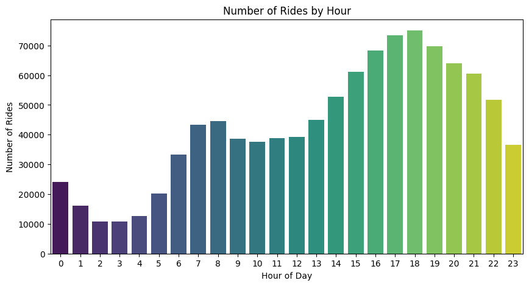
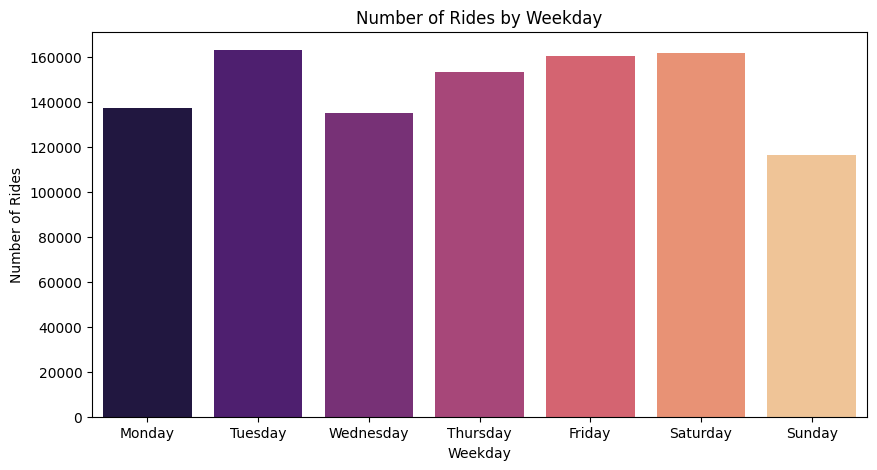
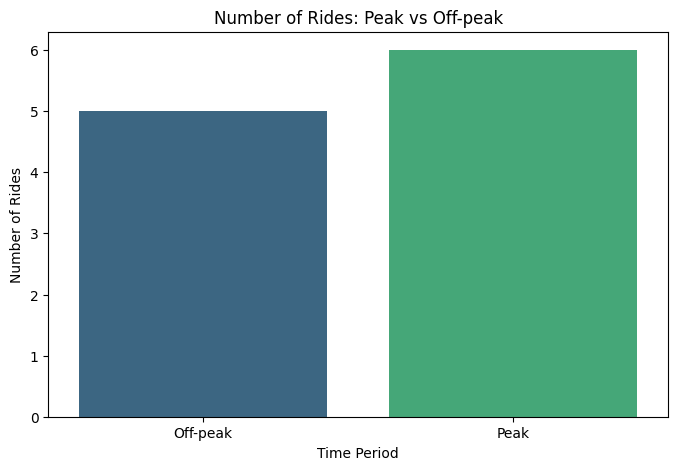
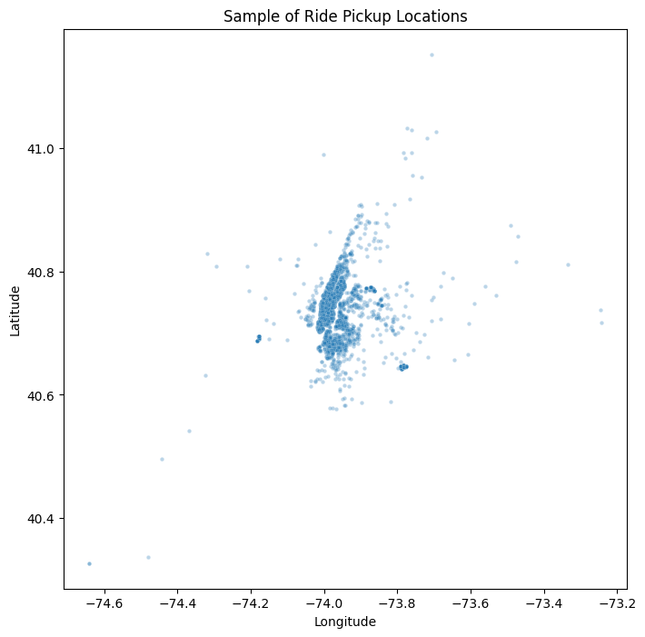
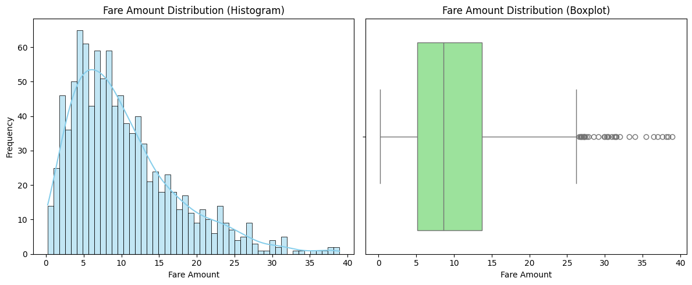
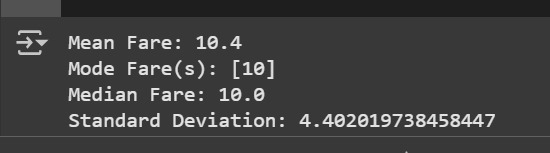

# Uber Fares Dataset Analysis

**Student Name:** Mfuranzima Nadette  
**Student ID:** 22831  
**Course:** Introduction to Big Data Analytics (INSY 8413)  
**Instructor:** Eric Maniraguha  
**Assignment:** Assignment I – Uber Fares Dataset Analysis  

## Project Overview

This project analyzes the Uber Fares Dataset from Kaggle to uncover insights about ride volumes and temporal patterns in New York City. The project includes data cleaning, feature engineering, exploratory data analysis (EDA), and data visualization using Python (Colab).

---

##  Data Preparation & Feature Engineering

- Loaded the raw dataset into Python using Pandas.
- Performed data cleaning by removing missing entries and correcting formats.
- Created new analytical features:
  - **Hour, Day, Month** from timestamps
  - **Weekday** classification
  - **Peak/Off-peak** ride indicator
- Exported the cleaned dataset as uber_cleaned.csv for Power BI or Excel analysis.

---

##  Exploratory Data Analysis (EDA)

Due to technical challenges with Power BI and Excel, I used Python libraries like Matplotlib and Seaborn to generate visualizations:

-  **Number of Rides by Hour** – Shows daily peak ride times.  
- **Rides by Weekday** – Shows ride frequency across the week.  
- *Peak vs Off-Peak Rides** – Categorizes rides into busy vs. normal hours.  
-  **Fare Distribution Histogram** – Shows how fare amounts vary.  
-  **Pickup Location Map** – (optional if included in the data).

 Additionally, I encountered an issue while trying to upload the full cleaned dataset to GitHub. Due to file size limitations, I had to **delete some records** to reduce the size and successfully upload the dataset. This may slightly affect the completeness of the data but the analysis remains representative and accurate.

---

##  Issues Faced & Workaround

- Encountered “Class Not Registered” error while launching Power BI.
- Excel also failed to load charts correctly.
- Resolved by completing full data analysis and chart creation in Python (Google Colab).
- Saved all charts as images and included them below.

---

##  Visualizations

### Rides by Hour  

### Rides by Weekday  

### Peak vs Off-Peak Rides  

### Pickup Location  

### Fare Amount Distribution (Histogram)  

### Fare Amount with Mean and Mode  

---

##  Dataset

- Cleaned dataset used for analysis:  
  [uber_cleaned.csv](uber_cleaned.CSV)

---

## Conclusions and Recommendations

- Ride demand peaks during rush hours: **7–9 AM** and **4–7 PM**.
- Weekdays, especially **Tuesday** and **Friday**, have higher ride counts.
- These patterns can guide Uber in **driver allocation** and **dynamic pricing strategies**.
- Future analysis could incorporate **weather** or **holiday** data for deeper insights.

---
---

## Python Notebook

The full code used for data cleaning, feature engineering, and visualization is available in the notebook:

 [uber_fares_codes.ipynb](./uber_fares_codes.ipynb)

It includes:
- Data loading
- Feature extraction (Hour, Day, Month, Weekday)
- Ride and fare distribution analysis
- Charts generated using Matplotlib & Seaborn
